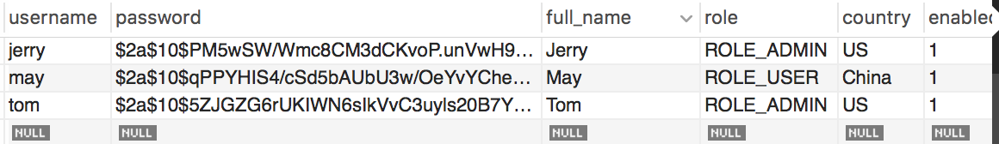

### How to Use
#### without auth

/hello
#### with auth

/security
/wordladder?dict=dictionary.txt&word1=code&word2=data
#### log out

/logout
#### available account

Database

username: tom
password: tom

username: jerry
password: jerry

username: may
password: may